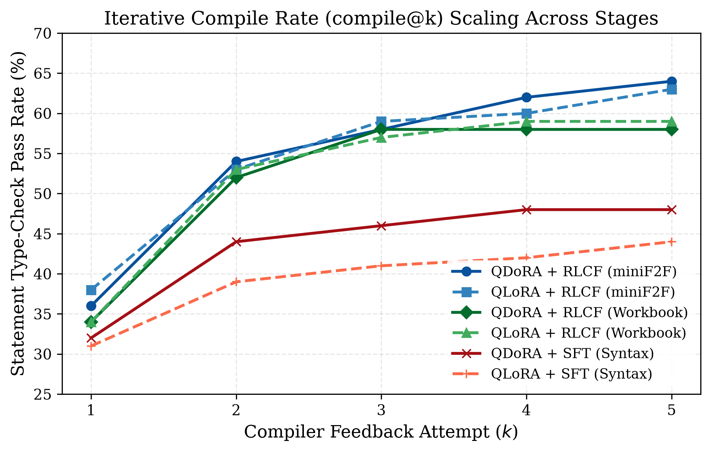
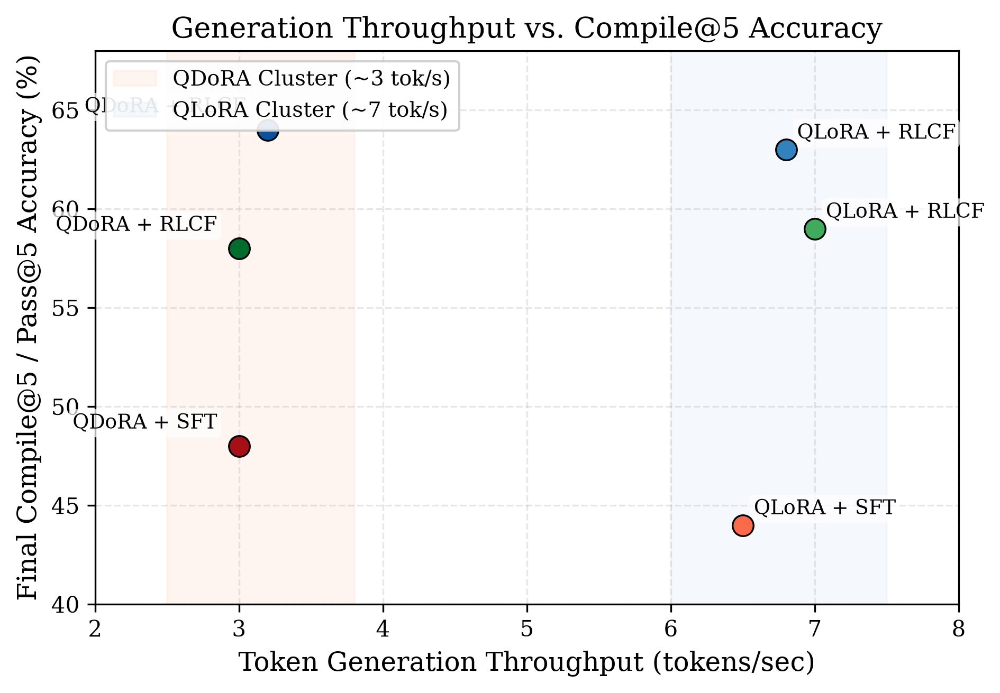
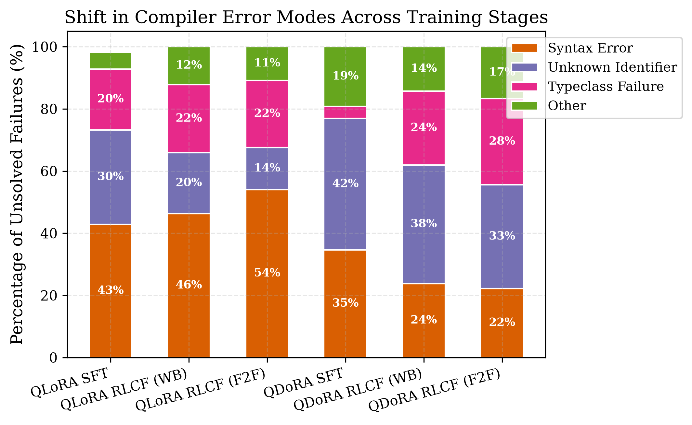

# High-Throughput Lean 4 Autoformalization Model for Local Inference

[](https://github.com/JanosMozer/leanbench)

A memory-efficient, single-GPU training and inference architecture for formalizing natural language mathematics into Lean 4 statement code. Incorporates whole-model NF4 quantization of a sparse Mixture-of-Experts (MoE) model, custom parameter unfusing, Group Relative Policy Optimization (GRPO) with persistent Lean REPL compiler feedback, and a dual-tier retrieval augmentation mechanism.

## 1. Introduction

### 1.1 Autoformalization Bottleneck in Formal Mathematics
Autoformalization, translating informal natural language mathematics into machine-checkable formal logic, is a primary bottleneck in formal verification. Modern interactive theorem provers, such as Lean 4, enforce rigid type-theoretic specifications. Minor syntax, namespace, or typeclass unification errors cause complete compilation failure. Manual translation is time-consuming, current autoformalization models are often expensive and error-prone.

### 1.2 Resource-Constrained Deployment
State-of-the-art autoformalization models rely on dense multi-billion parameter LLMs requiring multi-GPU server clusters. Deploying fine-tuned models on consumer-grade single-GPU hardware presents severe memory limitations:
1. Dense models (>14B parameters in 16-bit precision) exceed VRAM limits during training and generation.
2. Standard 4-bit quantization libraries (such as `bitsandbytes`) fail on fused MoE weight tensors.
3. Execution of sparse MoE models on single cards suffers from launch-bound per-expert CUDA kernels.

Evaluation of autoformalization methods is non-trivial, as correct compilation does not imply successful translation. This makes training environment construction difficult. The lack of proper training data and an accurate evaluation engine are critical issues in the field.

This project aims to stretch the limits of a smaller transformer model at the domain of formal mathematics, test a set of fine tuning methods and assert their effectiveness, and eventually construct a multi-agent high-throughput system to rapidly iterate in problems.

## 2. System Architecture


### 2.1 Base Model Selection
The base policy relies on `Qwen3-Coder-30B-A3B`, a sparse Mixture-of-Experts model containing 30B total parameters with ~3B active parameters per token across 48 transformer layers. Because Qwen-Coder is explicitly designed and pretrained for code generation and software synthesis, it has a better baseline comprehension of formal abstractions, strict type-theoretic semantics, and structured algorithmic logic required for interactive theorem proving compared to general-purpose language models. Furthermore, the sparse MoE architecture provides the expansive parameter capacity necessary to encode broad mathematical domain knowledge while constraining active forward-pass compute to ~3B parameters, this aids high throughput.

### 2.2 Memory Footprint & Quantization Engineering
For training and inference, a standard Nvidia RTX 5090ti was used.In standard `bfloat16` precision, the 30B model requires ~60 GB VRAM, exceeding the 32 GB budget of a single GPU. To fit both the base model and optimization states into VRAM:
1. **Whole-Model NF4 Double-Quantization**: The base model was loaded directly into host memory and quantized in-place using NormalFloat4 (NF4) with double quantization.
2. **GPU Allocation**: Model parameters reside entirely on GPU VRAM (~16.7 GB post-load, peak ~26–30 GB during training with micro-batch size 2). CPU offloading was completely disabled to avoid PCI-e latency bottlenecks.

### 2.3 MoE Expert Unfusing Engineering
The standard implementation of `Qwen3Moe` stores expert weights in 3D fused tensors. Quantization libraries cannot process 3D fused parameters.

To enable whole-model 4-bit quantization and expert-specific adapters, a custome layer is introduced:
1. Each layer's fused expert block is decomposed into individual `_Expert` submodules containing standard `nn.Linear` layers (`gate_proj`, `up_proj`, `down_proj`).
2. Pretrained weights are copied from fused 3D tensors into the unfused `nn.Linear` modules.
3. Quantization is applied in-place via `bitsandbytes.nn.Linear4bit`.
4. The forward pass is modified to execute expert routing over explicit linear layers without modifying the base model output semantics.

```python
class _Experts(nn.Module):
    def __init__(self, config):
        super().__init__()
        self.num_experts = config.num_experts
        self.act_fn = ACT2FN[config.hidden_act]
        for j in range(self.num_experts):
            self.add_module(str(j), _Expert(config.hidden_size, config.moe_intermediate_size))
```

PEFT (Parameter-Efficient Fine-Tuning) automatically converts `qwen3_moe` expert target configurations into fused parameter names, missing custom unfused submodules. To bypass this, `model.config.model_type` is dynamically masked to `"qwen3_moe_unfused"` during PEFT injection, permitting explicit target module matching.

### 2.4 LoRA vs. DoRA
Adapter modules are attached across attention and expert layers:
- **Attention Modules** (`q_proj`, `k_proj`, `v_proj`, `o_proj`): Rank \(r = 64\), \(\alpha = 128\).
- **Expert Modules** (`gate_proj`, `up_proj`, `down_proj`): Rank \(r = 8\), \(\alpha = 16\).
- **Trainable Parameters**: 468M parameters (~2.92% of total model parameters).
- **Adaptation Variants**:
  - **Standard QLoRA**: Linear low-rank updates.
  - **QDoRA (Weight-Decomposed Low-Rank Adaptation)**: Decomposes weight updates into directional vectors and magnitude scalars.

```
                       [ Informal Mathematical Statement ]
                                        │
                                        ▼
             ┌─────────────────────────────────────────────────────┐
             │ System B: Hybrid Retrieval Grounding (Premise RAG)  │
             │  (Dense Slogan Embeddings + BM25 Lexical Rerank)    │
             └──────────────────────────┬──────────────────────────┘
                                        │ Augment Prompt Context
                                        ▼
             ┌─────────────────────────────────────────────────────┐
             │ Qwen3-Coder-30B-A3B policy (NF4 Base + QLoRA Adapter)│
             └──────────────────────────┬──────────────────────────┘
                                        │ Sample Completion
                                        ▼
             ┌─────────────────────────────────────────────────────┐
             │ Lean 4 REPL Worker Pool (Persistent Mathlib State)  │
             └───────┬─────────────────────────────────────┬───────┘
                     │ Type-Check Failure                  │ Type-Check Success
                     ▼                                     ▼
  ┌─────────────────────────────────────┐   ┌───────────────────────────────┐
  │ System A: Compiler Repair Context   │   │ Formal Lean 4 Statement       │
  │ (Extract Missing Identifiers/Types) │   │ (Type-Checked & Faithfulness  │
  │ -> Re-prompt Policy (up to max_iter)│   │  Evaluated)                   │
  └─────────────────────────────────────┘   └───────────────────────────────┘
```

*Figure 1: End-to-end architecture of the Lean 4 autoformalization framework. Informal mathematical statements pass through System B premise grounding prior to inference by the quantized MoE policy. Generated code is evaluated by a persistent Lean 4 REPL pool. Failed completions enter an agentic repair loop supported by System A identifier lookup.*


## 3. Stage 1: Syntax Alignment

### 3.1 Dataset Preparation and Filtering
- **Corpus**: Combined dataset from Herald and Lean-Workbook (~720,000 original informal-formal statement pairs).
- **Subsampling & Filtering**: Subsampled to 40,000 clean pairs (mean sequence length: 198 tokens, p99: 470 tokens, max sequence length cap: 1024 tokens). Subsampling prevents overfitting to specific dataset phrasing while enforcing Lean 4 syntax formatting.
- **Prompt Structure**: Standardized system prompt instructing the model to translate mathematical statements into Lean 4 theorem statements ending in `:= by sorry`.

### 3.2 Completion-Only Cross-Entropy Loss
To maximize parameter updates on syntax generation rather than prompt encoding, loss is computed exclusively on assistant completions:
- Prompt tokens (system prompt + informal user input) are assigned a target label of `-100`.
- Cross-entropy loss is evaluated only on output Lean 4 statement tokens:


## 4. Stage 2: Reinforcement Learning with Lean Compiler Feedback (RLCF)

### 4.1 Group Relative Policy Optimization (GRPO)
Stage 1 produces syntactically valid code but struggles with deeper Lean 4 type-system semantics (such as typeclass instantiation and set coercion). Stage 2 uses GRPO to align output completions directly against Lean compiler responses.

For each informal statement prompt $q$, the policy $\pi_\theta$ generates a group of $G = 8$ completion outputs $\{o_1, o_2, \dots, o_G\}$. The objective function is defined as:

$$\mathcal{J}_{\text{GRPO}}(\theta) = \mathbb{E}\left[ \sum_{i=1}^G \left( \min\left( \frac{\pi_\theta(o_i \mid q)}{\pi_{\text{old}}(o_i \mid q)} A_i, \text{clip}\left(\frac{\pi_\theta(o_i \mid q)}{\pi_{\text{old}}(o_i \mid q)}, 1-\epsilon, 1+\epsilon\right) A_i \right) - \beta D_{\text{KL}}(\pi_\theta \parallel \pi_{\text{ref}}) \right) \right]$$

where the advantage $A_i$ is normalized within each group:

$$A_i = \frac{R(o_i) - \text{mean}(\mathbf{R})}{\text{std}(\mathbf{R}) + \delta}$$

and the KL penalty coefficient is set to $\beta = 0.04$.

### 4.2 Composite Gated Reward Function
Reward hacking is prevented by gating compiler feedback with a surface faithfulness metric relative to reference formalizations:

$$R(c, g) = \begin{cases} 
0.0 & \text{if } c \text{ is not well-formed} \\
0.1 & \text{if } c \text{ is well-formed but fails type-checking} \\
0.3 + 0.7 \times \text{faithfulness}(c, g) & \text{if } c \text{ type-checks against Mathlib}
\end{cases}$$

- **Well-formedness**: Evaluated via heuristic AST structure checks (balanced delimiters, explicit theorem declaration keywords, presence of type signatures).
- **Compilation Check**: Execution against Mathlib via Lean 4 REPL server.
- **Faithfulness Score**: Sequence similarity ratio between canonicalized candidate and reference code (removing theorem identifiers and proof bodies).


## 5. The A+B System

Autoformalization failure often stems from hallucinated namespace prefixes or missing Mathlib declaration identifiers. The framework incorporates a dual-tier retrieval architecture operating without model weight modifications.


### 5.1 System B: Initial Premise Grounding
- **Function**: Prepend relevant Mathlib theorem signatures and slogans to the initial informal prompt.
- **Mechanism**: Hybrid dense-sparse retrieval:
  1. Dense retrieval selects the top 100 declaration candidates using `SentenceTransformers` embeddings generated over Mathlib TheoremGraph slogans.
  2. BM25 lexical reranking filters candidates down to the top \(k=8\) declarations, ensuring exact symbol match preservation.

### 5.2 System A: Compiler Error Context Repair
- **Function**: Provide targeted context during repair iterations when compilation fails.
- **Mechanism**: When the compiler returns an error matching `unknown identifier 'X'` or `unknown constant 'X'`, System A extracts symbol `X`, queries the Mathlib index using fuzzy substring matching, and injects candidate declarations (`Did you mean: ...`) directly into the repair prompt.

```
┌─────────────────────────────────────────────────────────────────────────────┐
│                          System B: Premise Grounding                        │
│                                                                             │
│ Informal Query ──► SentenceTransformer ──► Dense Top-100 Candidates         │
│                                                  │                          │
│ Initial Prompt Context ◄── Mathlib Premises ◄── BM25 Lexical Reranking      │
└─────────────────────────────────────────────────────────────────────────────┘

┌─────────────────────────────────────────────────────────────────────────────┐
│                      System A: Compiler Context Repair                      │
│                                                                             │
│ Compiler Error ──► Regex Ident Extractor ──► Candidate Lookup               │
│ "unknown identifier 'X'"                          (Exact & Fuzzy Match)     │
│                                                          │                  │
│ Repair Prompt Context ◄── "Did you mean: Y, Z" ◄─────────┴──────────────────┘
└─────────────────────────────────────────────────────────────────────────────┘
```

*Figure 2: Dual-tier retrieval pipeline. System B provides domain premise context prior to initial generation. System A dynamically inspects compiler error outputs during repair cycles to resolve identifier reference failures.*

## 6. Agentic Compiler-Feedback Evaluation Loop

During evaluation, formal statement generation is executed within a multi-turn agentic feedback loop:

$$\text{Turn } 1 \longrightarrow \text{Compiler Check} \longrightarrow \begin{cases} \text{Pass} & \text{Output Formal Statement} \\ \text{Fail} & \text{Extract Error} + \text{System A Context} \longrightarrow \text{Turn } k+1 \end{cases}$$

1. **Turn 1 Generation**: The policy generates an initial theorem statement using System B prompt grounding.
2. **Type-Check Verification**: The statement is evaluated in `LeanREPLPool`. If it parses cleanly and type-checks without errors, it is marked as solved at iteration 1.
3. **Iterative Repair Loop**: If type-checking fails, compiler error logs (truncated to 800 characters) and System A candidate lookup suggestions are formatted into a repair message. The model generates a corrected statement. This cycle repeats up to `max-iters = 5`.


## 7. Empirical Results

### 7.1 Quantitative Benchmark Results (ProofNet Test Set)
Performance across 6 model configurations evaluated on the ProofNet test set (n=100 for LoRA variants, n=50 for DoRA variants):

| Metric | `qwen-lora-prosyntax` | `qwen-lora-proleanworkbook` | `qwen-lora-prominif2f` | `qwen-dora-postsyntax` | `qwen-dora-postleanworkbook` | `qwen-dora-postminif2f` |
| :--- | :---: | :---: | :---: | :---: | :---: | :---: |
| **Adapter Type** | QLoRA | QLoRA | QLoRA | QDoRA | QDoRA | QDoRA |
| **Training Stage** | Stage 1 (SFT) | Stage 2 (RLCF-WB) | Stage 2 (RLCF-F2F) | Stage 1 (SFT) | Stage 2 (RLCF-WB) | Stage 2 (RLCF-F2F) |
| **Sample Count (\(n\))** | 100 | 100 | 100 | 50 | 50 | 50 |
| **Well-Formed Rate (%)** | 96.0% | 99.0% | 99.0% | 100.0% | 98.0% | 98.0% |
| **Compile@1 Rate (%)** | 31.0% | 34.0% | 38.0% | 32.0% | 34.0% | 36.0% |
| **Compile@2 Rate (%)** | 39.0% | 53.0% | 53.0% | 44.0% | 52.0% | 54.0% |
| **Compile@3 Rate (%)** | 41.0% | 57.0% | 59.0% | 46.0% | 58.0% | 58.0% |
| **Compile@4 Rate (%)** | 42.0% | 59.0% | 60.0% | 48.0% | 58.0% | 62.0% |
| **Compile@5 / Pass@5 (%)** | **44.0%** | **59.0%** | **63.0%** | **48.0%** | **58.0%** | **64.0%** |
| **Mean Iterations Solved**| 1.52 | 1.56 | 1.67 | 1.46 | 1.52 | 1.72 |
| **Structural Faithfulness**| 0.469 | 0.633 | 0.639 | 0.484 | 0.603 | 0.623 |
| **Goal Exact Match (%)** | 0.0% | 0.0% | 0.0% | 0.0% | 0.0% | 0.0% |
| **Gold Compiles Sanity (%)**| 0.0% | 0.0% | 0.0% | 0.0% | 0.0% | 0.0% |
| **Throughput (tok/s)** | **6.5** | **7.0** | **6.8** | **3.0** | **3.0** | **3.2** |


### 7.2 Core Empirical Findings & Analysis

1. **Effectiveness of Stage 2 RLCF**: Reinforcement learning with compiler feedback increases statement compile@5 rates substantially over Stage 1 SFT baseline (QLoRA: 44.0% -> 63.0%; QDoRA: 48.0% -> 64.0%).
2. **QLoRA vs. QDoRA Performance-Throughput Trade-off**:
   - **Accuracy**: QDoRA achieves slightly higher overall compilation accuracy post-RLCF (64.0% vs. 63.0%) and higher initial SFT accuracy (48.0% vs. 44.0%).
   - **Throughput**: QLoRA achieves **~6.8–7.0 tokens/sec**, whereas QDoRA achieves **~3.0–3.2 tokens/sec**. The weight-decomposition calculation in DoRA adds execution overhead per forward pass on 4-bit MoE base weights.
3. **Multi-Turn Repair Gains**: Across all models, iterative compiler feedback improves overall pass rates significantly over single-turn generation (e.g., `qwen-lora-prominif2f` improves from compile@1 = 38.0% to compile@5 = 63.0%, a +25.0% net gain).
4. **Error Distribution Dynamics**: Unsolved problems transition from syntax/parse errors to missing identifier and typeclass resolution errors post-RLCF.

---

### 7.3 Standardized Metric Panel for Tracking Model Evolution

To provide rigorous tracking as models evolve, subsequent research iterations should report the following 9 metrics:

1. **Well-Formedness Rate (`well_formed`)**: Percentage of outputs parsing as valid Lean theorem signatures (balanced delimiters, formal structure).
2. **Iterative Compile Rate (`compile@k`)**: Percentage of statements successfully type-checking against Mathlib within \(k\) feedback attempts (\(k \in \{1, 2, 3, 4, 5\}\)).
3. **Final Pass Rate (`pass@N`)**: Terminal compile success rate at maximum iteration cap \(N\).
4. **Feedback Efficiency (`mean_iters_solved`)**: Average number of attempts required to solve successful problems. Lower values indicate higher quality initial attempts.
5. **Structural Code Faithfulness (`faithfulness_code`)**: Sequence matching ratio between normalized generated statements and canonical references:

$$\text{Faithfulness}(c, g) = \text{SequenceMatcher}\left(\text{norm}(c), \text{norm}(g)\right)$$

6. **Semantic Goal Exact Match (`goal_exact_match`)**: Percentage of generated statement elaborated goals matching reference elaborated goal strings within the Lean kernel state.
7. **Compiler Error Categorization (`error_breakdown`)**: Distribution of failure modes across unsolved instances (`unknown_ident`, `syntax`, `typeclass`, `type_mismatch`, `other`).
8. **Generation Throughput (`tokens_per_sec`)**: Token generation speed during inference passes.
9. **Hardware Resource Footprint**: Peak VRAM allocation (GB) and GPU compute utilization (%).



*Figure 3: Type-checking compile rate (compile@k) scaling across 5 feedback iterations. Stage 2 RLCF models consistently outperform Stage 1 SFT baselines, with multi-turn feedback adding 25–28% absolute compile accuracy.*


*Figure 4: Generation throughput versus compile@5 accuracy. QLoRA delivers ~2.2x higher generation speed with minimal accuracy drop compared to QDoRA.*


*Figure 5: Shift in compiler failure modes across training stages. RLCF reduces missing identifier errors (`unknown_ident`) while syntax parsing errors dominate remaining unsolved instances.*

### 8.1 MoE Single-GPU Compute Bottlenecks
While MoE models restrict active parameter computation to ~3B parameters per forward pass, running sparse MoE on a single GPU incurs fixed kernel launch overhead:
- All 128 expert kernel branches execute sequentially or in small parallel launches per micro-batch.
- Token packing (concatenating short sequences to length 1024) amortizes launch overhead, increasing throughput from <100 tok/s to **357 tok/s** during SFT training.

### 8.2 Sequence Packing vs. Completion Masking Trade-Off
- **Full Sequence Packing**: Maximizes GPU compute efficiency but forces training on prompt tokens unless complex custom cross-entropy attention masking is implemented.
- **Completion-Only Masking**: Prevents policy drift on prompt tokens but leaves padding overhead when sequences vary in length.

---

## References

[1] Qwen Team (2025). *Qwen3 Technical Report*. arXiv preprint arXiv:2505.09388. [https://arxiv.org/abs/2505.09388](https://arxiv.org/abs/2505.09388)

[2] Tim Dettmers, Artidoro Pagnoni, Ari Holtzman, and Luke Zettlemoyer (2023). *QLoRA: Efficient Finetuning of Quantized LLMs*. arXiv preprint arXiv:2305.14314. [https://arxiv.org/abs/2305.14314](https://arxiv.org/abs/2305.14314)

[3] Shih-Yang Liu, Chien-Yi Wang, Hongxu Yin, Pavlo Molchanov, Yu-Chiang Frank Wang, Kwang-Ting Cheng, and Min-Hung Chen (2024). *DoRA: Weight-Decomposed Low-Rank Adaptation*. arXiv preprint arXiv:2402.09353. [https://arxiv.org/abs/2402.09353](https://arxiv.org/abs/2402.09353)

[4] Zhihong Shao, Peiyi Wang, Qihao Zhu, Runxin Xu, Junxiao Song, Mingchuan Zhang, Y. K. Li, Y. Wu, and W. Liang (2024). *DeepSeekMath: Pushing the Limits of Mathematical Reasoning in Open Language Models*. arXiv preprint arXiv:2402.03300. [https://arxiv.org/abs/2402.03300](https://arxiv.org/abs/2402.03300)

[5] Daya Guo, Dejian Yang, Haowei Zhang, Chaoyi Song, Ruoyu Zhang, Runxin Xu, et al. (2025). *DeepSeek-R1: Incentivizing Reasoning Capability in LLMs via Reinforcement Learning*. arXiv preprint arXiv:2501.12948. [https://arxiv.org/abs/2501.12948](https://arxiv.org/abs/2501.12948)

[6] Guo Zheng, Stanislas Polu, Jesse Michael Han, Christian Szegedy, and Ilya Sutskever (2023). *ProofNet: Autoformalizing and Formally Proving Undergraduate-Level Mathematics Problems*. arXiv preprint arXiv:2302.12433. [https://arxiv.org/abs/2302.12433](https://arxiv.org/abs/2302.12433)

[7] DeepSeek-AI (2024). *Lean-Workbook: A Large-Scale Dataset for Lean 4 Autoformalization*. Hugging Face Datasets. [https://huggingface.co/datasets/deepseek-ai/Lean-Workbook](https://huggingface.co/datasets/deepseek-ai/Lean-Workbook)

[8] Alex J. Best (2024). *Herald: Natural Language to Lean 4 Autoformalization Dataset*. Hugging Face Datasets. [https://huggingface.co/datasets/alexjbest/herald](https://huggingface.co/datasets/alexjbest/herald)

[9] Facebook Research (2021). *miniF2F: A Cross-System Benchmark for Formal Olympiad Mathematics*. Hugging Face Datasets. [https://huggingface.co/datasets/facebook/miniF2F](https://huggingface.co/datasets/facebook/miniF2F)

[10] Hoskinson Center for Formal Mathematics (2023). *ProofNet: Undergraduate Mathematics Autoformalization Dataset*. Hugging Face Datasets. [https://huggingface.co/datasets/hoskinson-center/proofnet](https://huggingface.co/datasets/hoskinson-center/proofnet)
